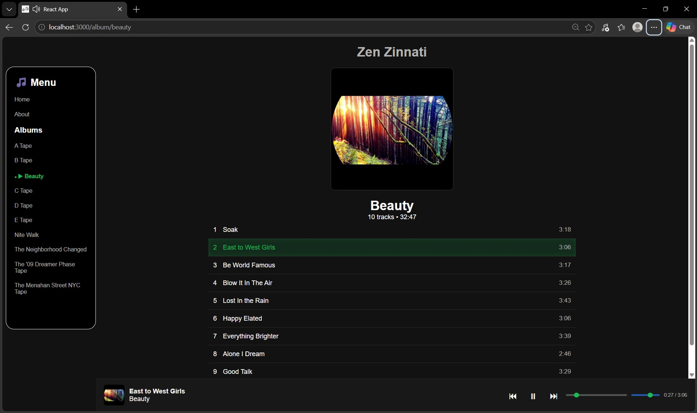
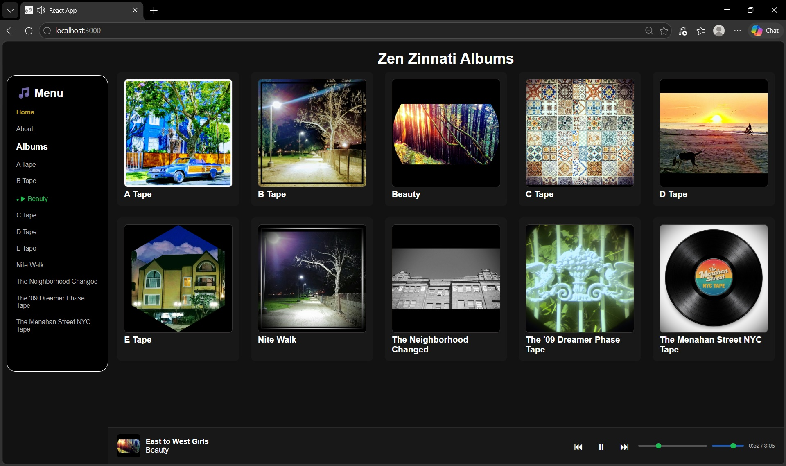
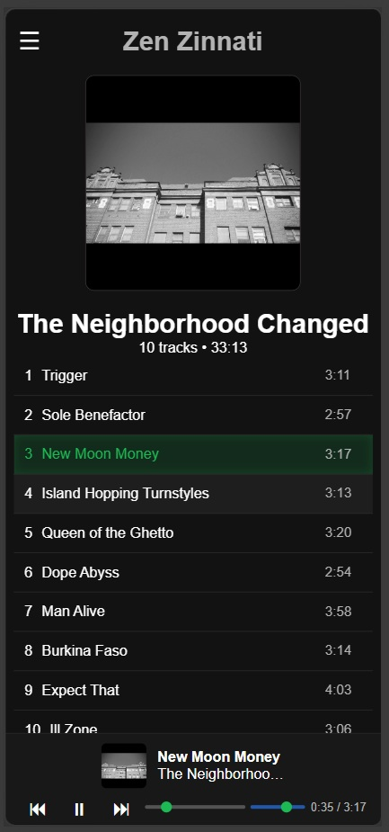
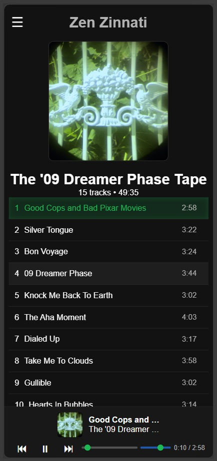
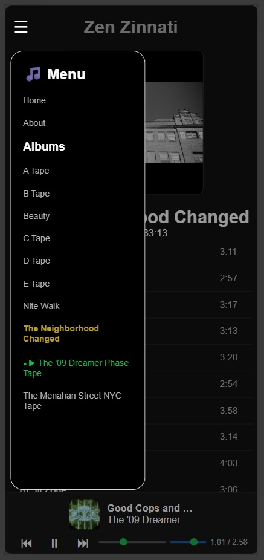

# 🎵 Zen Zinnati Music App

A Frontend music streaming web app showcasing the discography of **Zen Zinnati** — a music production project blending electronic, hip hop, indie, and experimental sounds.

🌐 **Live Site:** https://zenzinnatimusic.vercel.app/

---

## ✨ Features

* 🎧 Stream full albums and tracks
* 📱 Responsive design (mobile + desktop)
* ⏯️ Play / pause with keyboard (spacebar / enter)
* 📀 Album pages with track durations
* 🔊 Persistent audio player across pages
* 🧭 Click currently playing track → navigate to album
* ☁️ Cloud-hosted audio (Cloudinary)
* 🛍️ Merch store with shopping cart and Stripe checkout
* 🎨 Per-product color and size selection with live image switching
* 🛒 Persistent cart via localStorage
* 📧 Automated order receipt emails via Stripe

---

## Screenshots







---

## 🛠️ Tech Stack

* **Frontend:** React, React Router
* **Backend:** Node.js, Express (hosted on Render)
* **Payments:** Stripe (hosted checkout)
* **Data Source:** Local JSON (`/public/data/albums.json`)
* **Hosting:** Vercel (frontend), Render (backend)
* **Media Hosting:** Cloudinary + local assets

---

## 📁 Project Structure

```
ZENZINNATI-MUSIC/
├── public/
│   ├── music/          # Local audio files (dev only)
│   ├── covers/         # Album artwork + merch images
│   └── data/
│       └── albums.json # Main data source
├── src/
│   ├── components/     # Player, UI components
│   ├── pages/          # Album, About, Merch, Success, etc.
│   └── App.js
├── backend/
│   ├── server.js       # Express server + Stripe checkout session
│   └── .env            # STRIPE_SECRET_KEY (not committed)
├── scripts/
│   └── generateAlbums.js
```

---

## 🛍️ Merch & E-Commerce

The merch page is a fully functional e-commerce feature built with React and Stripe.

### Features
- Product cards with size and color dropdowns
- Per-color product images with front/back image carousel
- Sliding cart drawer with quantity controls
- Cart persists across page refreshes via localStorage
- Stripe hosted checkout for secure payments
- Automated receipt emails sent to customers via Stripe

### How it works
1. User selects size/color and adds items to cart
2. Cart is saved to localStorage until checkout or cleared
3. Clicking Checkout calls the Express backend
4. Backend creates a Stripe Checkout Session and returns a URL
5. User is redirected to Stripe's hosted payment page
6. After payment, user lands on `/success` and cart is cleared

### Running the backend locally

```bash
cd backend
npm install
node server.js
```

Make sure you have a `.env` file in the backend folder:
STRIPE_SECRET_KEY=sk_test_your_key_here

The backend runs on `http://localhost:4000` by default.

### Environment Variables

**Frontend** (Vercel or `.env` in root):
REACT_APP_API_URL=http://localhost:4000

**Backend** (Render or `.env` in backend folder):
STRIPE_SECRET_KEY=sk_test_your_key_here

---

## ⚠️ Album Generator Script

This project includes a script to generate album data:

```bash
npm run generate
```

### What it does

* Scans `/public/music`
* Generates album + track structure
* Updates `albums.json`

---

### ⚠️ Important Notes (READ THIS)

* Running this script will **modify `albums.json`**
* New tracks will default to **local file paths**:

  ```
  /music/AlbumName/track.mp3
  ```

---

### ☁️ Cloudinary Workflow

This app uses Cloudinary for production audio.

After running the generator:

1. Open:

   ```
   public/data/albums.json
   ```
2. Find newly added tracks
3. Replace their `src` values with Cloudinary URLs
4. Save and commit

---

### 🚨 Warning

Do NOT rely on the generator for:

* Final `src` values (Cloudinary)
* Manual edits inside `albums.json`

Always verify before deploying.

---

## 🚀 Getting Started

### 1. Clone the repo

```bash
git clone https://github.com/topmiljm/zenzinnati-music.git
cd my-music-app
```

### 2. Install frontend dependencies

```bash
npm install
```

### 3. Install backend dependencies

```bash
cd backend
npm install
```

### 4. Run locally (two terminals)

Terminal 1 — Frontend:
```bash
npm start
```

Terminal 2 — Backend:
```bash
cd backend
node server.js
```

---

## 🎨 About the Artist

Zen Zinnati is a music production project of **James Topmiller**, originally from Cincinnati, Ohio and now based in Los Angeles.

The project spans about a half decade of recordings, capturing a unique blend of genres and experimentation.

---

## 📬 Contact

* email: 1mntnjames@gmail.com

---

## 🔮 Future Improvements

* 🔐 User accounts / favorites
* 📦 Order history and tracking
* 📱 Progressive Web App (PWA)
* 🎚️ Better mobile background playback
* ☁️ Fully automated Cloudinary sync

---

## 📄 License

This project is currently for personal/portfolio use.
